# multi-agent-system

[](https://github.com/ara-5/multi-agent-system/actions/workflows/ci.yml)
[](LICENSE)
[](pyproject.toml)
[](https://claude.ai/code/artifact/43ff9a43-2bfe-4ba7-9bbb-c12a43275fff)

**[Try the live demo →](https://claude.ai/code/artifact/43ff9a43-2bfe-4ba7-9bbb-c12a43275fff)**
Three trained policies running *live inference in your browser* — the actual
exported neural network weights, not a recorded video — with a real-time check
that the browser's computed action matches Python's, frame by frame.

Multi-agent reinforcement learning (MARL): agents that learn cooperative,
competitive, *and* communicative behavior through training, rather than
following hand-written rules — including the full debugging story behind the
communicative one, which didn't work at first, and *why* (an architecture
problem, not a training-budget one) before it did (see
[Demo: simple_speaker_listener](#demo-simple_speaker_listener-emergent-communication)).

**Stack:** [PettingZoo](https://pettingzoo.farama.org/) (multi-agent env API) +
[SuperSuit](https://github.com/Farama-Foundation/SuperSuit) (env wrappers) +
[Stable-Baselines3](https://stable-baselines3.readthedocs.io/) (PPO).

**Tasks**, both from the [MPE2](https://mpe2.farama.org/) environment suite:

- **`simple_spread`** (cooperative) — N agents must cover N landmarks while
  avoiding collisions. Trained via parameter sharing: one PPO policy controls
  every agent, since all agents are homogeneous (same obs/action space).
- **`simple_tag`** (competitive, predator/prey) — adversaries chase good agents.
  The two roles have different observation spaces and opposing rewards, so
  parameter sharing doesn't apply; see [Independent policies](#independent-policies-simple_tag)
  below for how this repo trains genuinely separate per-role policies.
- **`simple_speaker_listener`** (cooperative, emergent communication) — a speaker
  that can see the target landmark but can't move, and a listener that can move
  but can't see the target; they share one reward, so they need a communication
  protocol to succeed. Trained as a single joint policy over two independent
  sub-networks with an explicit information bottleneck (see
  [bottleneck_policy.py](#emergent-communication-simple_speaker_listener) below)
  — and, spoiler, the first (more obvious) architecture didn't work, which is
  more interesting than if it had; see the honest, measured results below.

## Project layout

```
common/       shared code: FixedOpponentWrapper (simple_tag), JointPolicyEnv (comm)
spread/       simple_spread: train.py, evaluate.py, record_demo.py
tag/          simple_tag: train.py, evaluate.py, record_demo.py
comm/         simple_speaker_listener: train.py (the working, bottlenecked
              architecture), train_baseline.py (the original, kept for the
              record), bottleneck_policy.py, evaluate.py, record_demo.py,
              analyze_communication.py
tools/        plot_rewards.py, export_policy_weights.py, record_trajectories_*.py
web_demo/     the live in-browser demo (index.html + data/)
assets/       committed reward curves, confusion matrix, demo GIFs
tests/        unit tests for common/
```

Every task follows the same `train.py` → `evaluate.py` → `record_demo.py`
pattern; `tools/` and `web_demo/` build on top of whichever models the task
folders produce.

## Demo: simple_spread (cooperative)

| Random policy (untrained) | PPO policy (200k timesteps) |
| --- | --- |
| 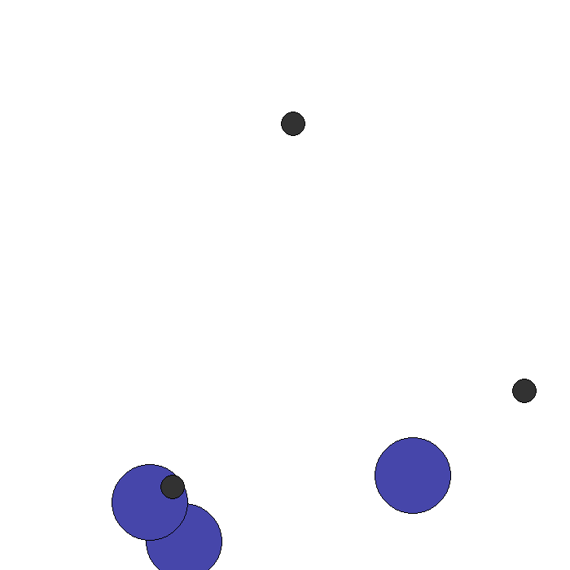 | 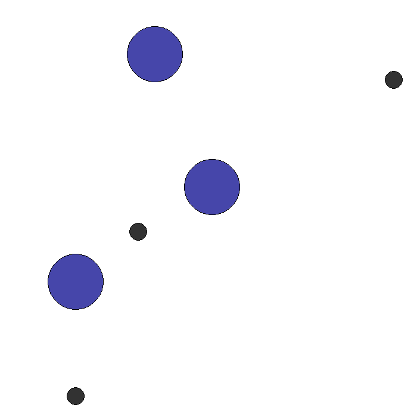 |

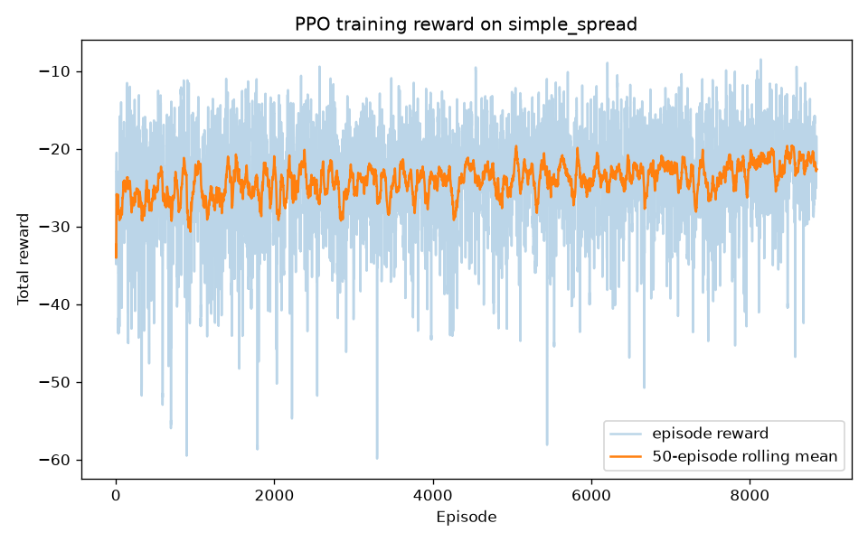

Reward is the sum of per-agent distance-to-nearest-landmark penalties plus
collision penalties, so it's always negative — closer to zero is better. The
50-episode rolling mean improves from roughly -28 to -22 over 200k timesteps
(~9k episodes) of untuned PPO on a single CPU.

## Demo: simple_tag (competitive, predator/prey)

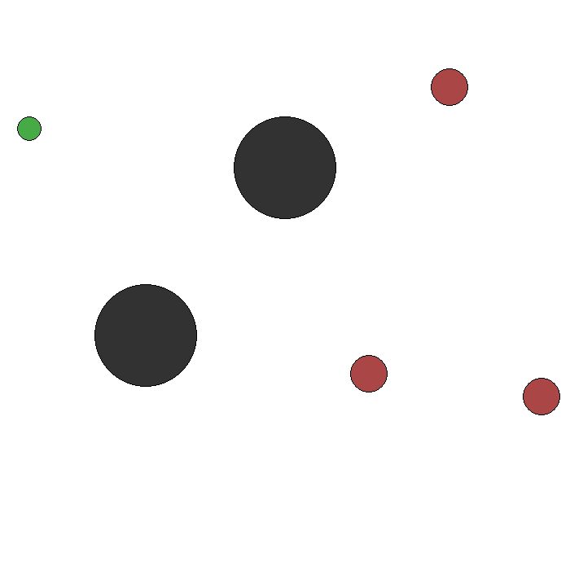

| Adversary (predator) training | Prey training (vs. the trained adversary above) |
| --- | --- |
| 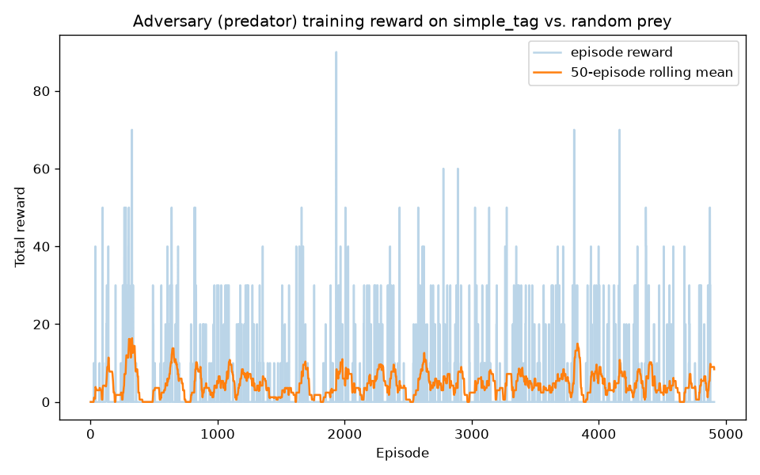 | 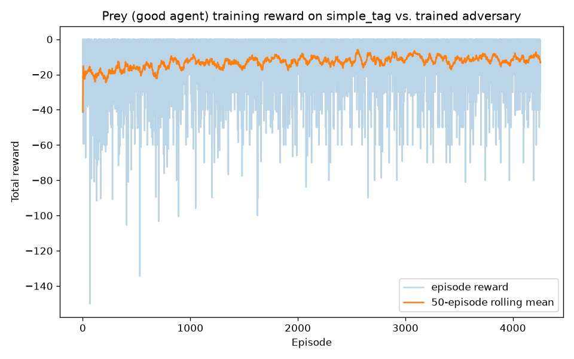 |

### Results (20 seeded episodes each, mean ± std total reward)

| Adversary policy | Prey policy | Adversary reward | Prey reward |
| --- | --- | --- | --- |
| trained | trained | 33.00 ± 42.32 | -11.60 ± 13.82 |
| trained | random | 28.50 ± 47.88 | -23.13 ± 22.45 |
| random | trained | 15.00 ± 32.17 | -5.93 ± 10.66 |
| random | random | 10.50 ± 27.29 | -14.57 ± 17.05 |

Both trained policies clearly beat their random counterparts regardless of
opponent: the trained adversary nearly 3x's random-adversary reward (28.5-33 vs.
10.5-15), and trained prey roughly halves its penalty versus random prey (-5.93 to
-11.60 vs. -14.57 to -23.13). High variance is expected — a handful of adversaries
either catch prey (discrete +10/-10 collision reward) or don't in a given 25-step
episode, so per-episode reward is closer to a coin flip than a smooth signal;
that's why the table reports 20-episode means rather than a single run.

## Demo: simple_speaker_listener (emergent communication)

| Random policy (untrained) | Trained PPO policy (bottleneck architecture) |
| --- | --- |
| 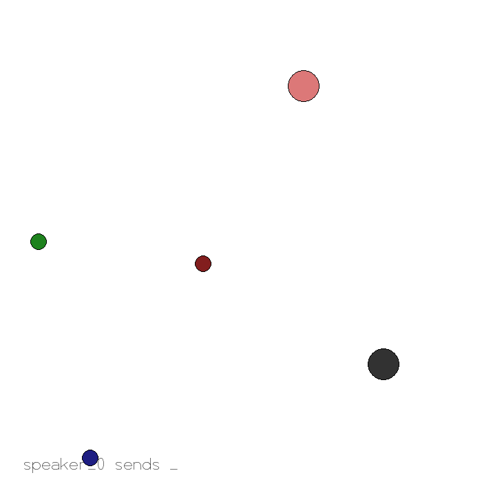 | 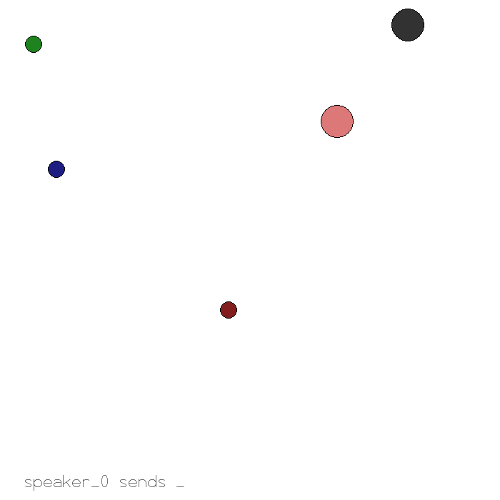 |

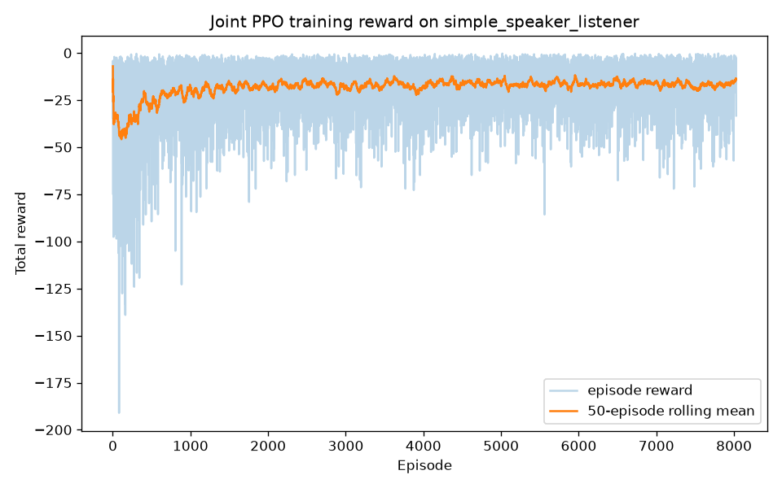

Reward (shared, negative listener-to-target distance) improves substantially
over training. On its own that would only be weak evidence the agents learned
to *communicate* specifically — this task's actual result took two more
architecture attempts, a real metric, and a multi-seed check that overturned
the first conclusion, to get right:

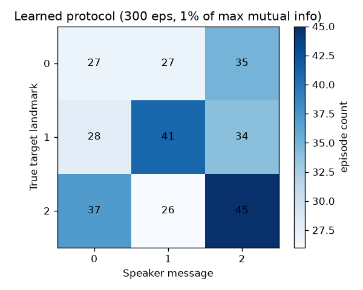

**The headline number**: the best model found (bottleneck architecture,
300k timesteps, `ent_coef=0.01`) reaches mutual information of **1.5802 bits
— 99.7% of the 1.585-bit maximum**, and the confusion matrix above (300
held-out episodes) is a clean diagonal — a real protocol, not an incidental
correlation. But that number, on its own, overstates how *reliably* this
setup produces a protocol — see below.

That result took three attempts to get right — see
[Design notes](#emergent-communication-design-notes) for the full story —
plus a fourth step that mattered just as much: rerunning the two bottleneck
conditions with 2 more random seeds each, because a single training run can't
tell you whether a result is a reliable effect or a lucky draw (all rows:
20-episode reward mean ± std, 300-episode MI/entropy;
`comm/evaluate.py` + `comm/analyze_communication.py`, same seeds):

| Model | Reward | Mutual information | Message entropy |
| --- | --- | --- | --- |
| Random policy | -50.71 ± 42.07 | 1.0% of max | 99.8% of max |
| 1. Shared network, 200k steps, `ent_coef=0.0` | -18.86 ± 12.82 | 0.9% of max | 99.6% of max |
| 2. Shared network, 1M steps, `ent_coef=0.02` | -11.30 ± 7.64 | 13.5% of max | 98.1% of max |
| 3. Bottleneck architecture, 300k steps, `ent_coef=0.0` — **3 seeds** | -20.37 ± 0.71 | 58.1% ± 2.0% of max | 58.1% ± 2.0% of max |
| 4. Bottleneck architecture, 300k steps, `ent_coef=0.01` — **3 seeds** | -20.51 ± 0.11 | 51.7% ± 40.8% of max | 51.7% ± 40.8% of max |

Attempts 1–2 improved reward while barely moving the metric that actually
mattered, because that architecture never required the message to carry any
information at all — note their message entropy is *high* (98–99.6% of max,
same as random): the speaker was already using all 3 messages plenty, just not
*informatively*. That's the tell that message entropy alone (a common proxy in
emergent-communication work) isn't sufficient evidence of a protocol — a
policy can use its full message vocabulary and still convey nothing.

Attempt 3 (bottleneck architecture, no entropy bonus) fixed the shortcut and
is **highly consistent across seeds**: 55.3%, 59.5%, 59.5% — every run lands
on a stable, deterministic protocol that distinguishes one target from the
other two, but never fully separates all three. Attempt 4 (same architecture
+ a small entropy bonus) is where the story gets more interesting than a
clean success: across the *same* 3 seeds, mutual information came out
**99.7%, 0.0%, and 55.3%** — the entropy bonus's one prior result (99.7%,
featured above and in the live demo) turned out to be the best of three, not
the reliable outcome. The 0.0% run is a complete collapse:

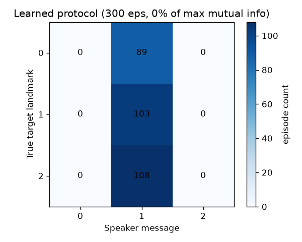

the speaker emitting the *same single message regardless of target*, every
episode — the entropy bonus didn't just fail to help that seed, it destroyed
the protocol attempt 3 would have found without it. On
average, adding the entropy bonus did not outperform the architecture fix
alone, and made the outcome far less predictable (std of ±40.8 points vs.
±2.0). The honest conclusion: **the architecture fix (splitting the network)
is a reliable, load-bearing result** — it consistently produces at least a
partial protocol, every seed, every time. **The entropy bonus on top of it is
not reliable** — it's a high-variance nudge that can just as easily erase the
signal as complete it, and calling attempt 4 "solved" from a single run (as
this README did, before rerunning it with more seeds) would have been the
exact reward-curve-shaped mistake this project keeps warning about, just one
level higher: a metric-curve-shaped mistake instead of a reward-curve-shaped
one.

One more thing the multi-seed run makes vivid: reward barely moves across
this entire range. -20.37 (partial protocol, every seed) vs. -20.51 ± 0.11
(collapse, partial, or near-perfect protocol, same reward to two decimal
places) — a *complete* communication collapse gets statistically
indistinguishable reward from a *clean, near-deterministic* protocol. If this
project had only looked at reward, all four attempts would have looked like
the same, boring, mediocre result — and both the original bug and this
seed-variance finding would have gone completely unnoticed.

## Setup

```bash
python -m venv .venv
.venv/Scripts/activate   # Windows; use `source .venv/bin/activate` on macOS/Linux
pip install -e .
```

For experiment tracking on [Weights & Biases](https://wandb.ai/) instead of static
images, install the optional extra and log in once (`wandb login`), then pass
`--wandb` to any task's `train.py`:

```bash
pip install -e ".[wandb]"
python spread/train.py --wandb --wandb-project multi-agent-system
```

## Train: simple_spread

```bash
python spread/train.py --timesteps 200000
```

Saves the trained policy to `models/simple_spread_ppo.zip`. Key flags:
`--num-agents`, `--max-cycles`, `--num-vec-envs`, `--out`.

Add `--tensorboard-log runs` for live TensorBoard curves, or regenerate the
static reward-curve image from the CSV log:

```bash
python tools/plot_rewards.py --log logs/monitor.csv --out assets/reward_curve.png
```

## Train: simple_tag <a name="independent-policies-simple_tag"></a>

Stable-Baselines3 trains one policy per env, but `simple_tag`'s two roles
(adversary/predator vs. good/prey) have different observation spaces and opposing
rewards — parameter sharing across them isn't meaningful. This repo instead uses
`common/opponent_wrapper.py`'s `FixedOpponentWrapper` to expose only one role as
controllable per training run, with the other role acting via a fixed policy
(random, or a previously trained model): train adversaries vs. a random prey
baseline, then train prey against the now-frozen trained adversary.

```bash
python tag/train.py --role adversary --timesteps 100000 --out models/simple_tag_adversary
python tag/train.py --role good --opponent-model models/simple_tag_adversary \
    --timesteps 100000 --out models/simple_tag_good
```

This is **not** true simultaneous self-play (both sides improving together, which
would need a multi-policy trainer like RLlib) — it's a simpler two-stage
alternative that still produces genuinely independent, role-specific policies.

## Train: simple_speaker_listener <a name="emergent-communication-simple_speaker_listener"></a>

Unlike `simple_tag`, this task is fully cooperative with one shared reward — so
unlike the freeze-one-side approach above, freezing either agent here breaks
learning entirely (a frozen random speaker sends a message uncorrelated with the
target, so there's nothing for the listener to learn to decode). Instead,
`common/joint_env.py`'s `JointPolicyEnv` flattens both agents into a single
`gymnasium.Env`: one PPO policy sees both agents' observations concatenated and
outputs both agents' actions at once (a `MultiDiscrete` joint action space),
so the two roles are trained simultaneously by construction.

That much was true from the start and is still true. What *didn't* work at
first is using one shared network on top of that joint env — it has no reason
to ever route target information through the message, since the same network
that produces the listener's movement action can just read the speaker's raw
observation directly. `comm/bottleneck_policy.py`'s
`SpeakerListenerBottleneckPolicy` fixes this: it's still one PPO policy over
the same joint env, but internally it's two independent sub-networks with no
shared layer — message logits come only from the speaker's slice of the
observation, movement logits only from the listener's slice — so the message
is architecturally the *only* channel target information can travel through.
The value function is still centralized (it sees everything), which is
standard practice and doesn't weaken that guarantee.

```bash
python comm/train.py --out models/comm_ppo
```

(Defaults to 300k timesteps and `ent_coef=0.01`. The bottleneck architecture
alone, with no entropy bonus, is the reliable part of this result: it
consistently reaches ~55-60% of max mutual information across seeds —
architecture was the main lever, not tuning — but settles for a protocol
that only distinguishes 2 of 3 targets. The default `ent_coef=0.01` is *not*
a reliable fix for that remaining gap: across 3 seeds it produced anywhere
from a complete communication collapse to a clean, fully-separated protocol.
Pass `--seed N` to reproduce a specific run, and see
[Design notes](#emergent-communication-design-notes) for the full multi-seed
story, including the original single-network approach, kept at
`comm/train_baseline.py` for the record.) This is centralized training *and*
centralized execution (one policy needs both agents' observations at inference
time too) — a real limitation compared to decentralized execution, but a
reasonable trade for a fully-cooperative task where nothing is lost by not
decentralizing.

## Evaluate

```bash
python spread/evaluate.py --model models/simple_spread_ppo --episodes 20
python tag/evaluate.py --adversary-model models/simple_tag_adversary \
    --good-model models/simple_tag_good --episodes 20
python comm/evaluate.py --model models/comm_ppo --episodes 20
python comm/analyze_communication.py --model models/comm_ppo --episodes 300
```

Runs N seeded episodes and prints a mean ± std reward summary — a single episode
is too noisy to be a meaningful result on its own (see the simple_tag results
table above). Add `--render` to watch one episode interactively instead. Omit
either `--adversary-model`/`--good-model` to use a random policy for that role,
useful for baseline comparisons. `analyze_communication.py` is specifically for
`simple_speaker_listener`: it computes the mutual information between the true
target and the speaker's message to check whether a real protocol emerged (see
the results above).

Regenerate the demo GIFs (omit `--model`/`--*-model` args for a random-policy
baseline):

```bash
python spread/record_demo.py --model models/simple_spread_ppo --out assets/demo_trained.gif
python tag/record_demo.py --adversary-model models/simple_tag_adversary \
    --good-model models/simple_tag_good --out assets/demo_tag.gif
python comm/record_demo.py --model models/comm_ppo --out assets/demo_comm.gif
```

## Live demo (`web_demo/`)

**[claude.ai/code/artifact/43ff9a43-2bfe-4ba7-9bbb-c12a43275fff](https://claude.ai/code/artifact/43ff9a43-2bfe-4ba7-9bbb-c12a43275fff)**

The `simple_speaker_listener` tab includes a "force the message" widget: holding
the listener's own observation fixed at the current frame, it reruns only the
listener sub-network for every possible message and shows the resulting move —
the real received message is highlighted. It's a direct, interactive way to see
that the movement is causally driven by the message (not just landmark
position), rather than taking the mutual-information number on faith.

`tools/export_policy_weights.py` extracts a trained SB3 policy's weight matrices
to JSON, and `tools/record_trajectories_*.py` records real rollouts (entity
positions, observations, actions) frame by frame. `web_demo/index.html`
reimplements each policy's forward pass in plain JavaScript, then, for every
frame of a replayed rollout, recomputes the action from the recorded
observation and checks it against what Python actually chose. `simple_spread`
and `simple_tag` use SB3's default `MlpPolicy` (two `tanh` hidden layers + a
linear action head); `simple_speaker_listener` uses the bottleneck
architecture's two independent sub-networks instead — the exporter detects
which one a model uses and emits the matching JSON shape. Regenerate the data
any of these scripts produce with:

```bash
python tools/export_policy_weights.py --model models/simple_spread_ppo --out web_demo/data/weights_spread.json
python tools/record_trajectories_spread.py --model models/simple_spread_ppo --out web_demo/data/trajectories_spread.json
python tools/record_trajectories_tag.py --out web_demo/data/trajectories_tag.json
python tools/export_policy_weights.py --model models/comm_ppo --out web_demo/data/weights_comm.json
python tools/record_trajectories_comm.py --model models/comm_ppo --out web_demo/data/trajectories_comm.json
python comm/analyze_communication.py --model models/comm_ppo --episodes 300 --json-out web_demo/data/analysis_comm.json
```

## Test

```bash
pip install -e ".[dev]"
ruff check .
pytest tests/
```

Unit tests cover `FixedOpponentWrapper`'s and `JointPolicyEnv`'s pure
agent-filtering/obs-flattening logic against fake envs — the training loops
themselves are stochastic and not a useful unit-test target, so CI instead
smoke-tests them end-to-end (tiny timestep counts, real environments) rather
than trying to assert on outcomes.

## Design notes / what I learned <a name="emergent-communication-design-notes"></a>

- **PettingZoo's MPE environments moved to a separate `mpe2` package** in recent
  PettingZoo releases (1.27+) — most tutorials still reference the old
  `pettingzoo[mpe]` extra, which now raises an `ImportError` pointing at `mpe2`.
- **Parameter sharing (one policy, all agents) via SuperSuit's `concat_vec_envs_v1`**
  is the simplest way to get PettingZoo working with an off-the-shelf SB3
  algorithm, but it assumes homogeneous agents (same obs/action space) — it
  doesn't work for an asymmetric task like `simple_tag`, which is why that task
  uses `common/opponent_wrapper.py`'s `FixedOpponentWrapper` instead (see
  [Train: simple_tag](#independent-policies-simple_tag)).
- **200k timesteps of untuned PPO on CPU gets modest but real improvement**
  (rolling mean reward roughly -28 → -22) — not a dramatic result, which is
  itself informative: `simple_spread`'s reward is dense and shaped, so most of
  the gain happens early, and squeezing out more would need reward-normalization,
  a learning-rate schedule, or more timesteps rather than architecture changes.
- **The training-curve and evaluation-time reward numbers use different
  accounting, on purpose** — don't be alarmed that they don't match. During
  training, SuperSuit vectorizes each agent into its own env slot, so
  `VecMonitor`'s per-episode reward in `assets/reward_curve.png` is a *single
  agent's* return. `spread/evaluate.py` instead sums reward across every agent's turn
  in the AEC loop; since `simple_spread` gives every agent the same shared team
  reward each step, that sum is roughly `num_agents`x larger in magnitude
  (hence -22 during training vs. -66 in a 3-agent evaluation of the same policy).
- **`simple_tag`'s reward is sparse and discrete** (±10 per collision, decided in
  a 25-step episode) rather than `simple_spread`'s dense distance shaping — that's
  why its evaluation numbers have much higher variance and need a 20-episode mean
  to say anything, versus a single episode being roughly informative for
  `simple_spread`.
- **A rising reward curve doesn't prove the thing you set out to test.**
  `simple_speaker_listener`'s first-attempt reward improved substantially
  (-38 → -15), which would normally be reported as a win — but
  `comm/analyze_communication.py` showed the speaker's message carried only ~1% of
  the mutual information it would need to encode the target. The reward gain
  was real, but most likely the listener finding a generically useful movement
  policy that didn't require decoding anything. I only caught this because I
  built a metric to check the actual claim (message ↔ target correspondence)
  instead of trusting the reward curve alone.
- **Tuning (more timesteps + an entropy bonus) helped, but only a little, and
  that itself was the real signal.** 5x the timesteps (1M) and `ent_coef=0.02`
  raised mutual information from 0.9% to 13.5% of the theoretical max — real,
  measurable movement, but still far from a clean protocol, and the natural
  next move (throw even more training or a bigger entropy bonus at it) would
  have kept being a diminishing-returns grind. That itself is a clue: if a fix
  aimed squarely at the problem barely moves the needle, the problem is
  probably somewhere the fix can't reach.
- **The actual bug was architectural, not a training-budget problem.**
  `JointPolicyEnv` concatenates the speaker's observation (which contains the
  goal) and the listener's observation into one vector, fed to one shared
  network. Nothing about that architecture ever requires target information to
  pass through the message: the same network that produces the listener's
  movement logits has direct, unrestricted access to the speaker's raw
  observation too, so gradient descent can just learn to read the goal
  directly and route it to the movement action, leaving the message free to be
  noise. `ent_coef` was fighting a shortcut that always existed — no amount of
  it could ever close a gap that was architectural, not a matter of exploration.
- **The fix: split the actor into two sub-networks with no shared layer**
  (`comm/bottleneck_policy.py`). Message logits come from a small network that
  only ever sees the speaker's observation slice; movement logits come from a
  separate small network that only ever sees the listener's slice. The value
  function stays centralized (sees everything) — a centralized critic with
  decentralized actors is standard practice and doesn't weaken the guarantee
  above. Implementing this means overriding SB3's `ActorCriticPolicy._build`
  directly: the default implementation always inserts one trainable linear
  layer across the *entire* latent vector to produce action logits, which
  would silently recreate the same shortcut (that layer could route speaker
  features into the movement columns) even with two "separate" sub-networks
  feeding into it. The fix is to make each sub-network already emit its final,
  separate logits, and replace that layer with `nn.Identity()` so nothing ever
  remixes them.
- **The architecture fix alone (still `ent_coef=0.0`) jumped to 55.3% of max
  mutual information in the same 300k steps** — immediately, no tuning. But the
  resulting protocol was a real, deterministic mapping that only used 2 of the
  3 available messages: one message meant "target A", the other meant "not
  target A" (ambiguous between the remaining two). That's a stable local
  optimum, not noise — the listener still observes all 3 landmarks' raw
  positions and can partially compensate for an ambiguous message, so there
  was already-decent reward without ever needing the third message. Adding
  back a small entropy bonus (`ent_coef=0.01`) discouraged settling for that
  partial equilibrium in this particular run and reached **99.7% of max**, a
  clean diagonal confusion matrix.
- **A single run of "it worked" is exactly the claim this whole investigation
  says not to trust — so I reran both bottleneck conditions with 2 more
  random seeds each before believing it.** The architecture-alone condition
  held up: 55.3%, 59.5%, 59.5% across 3 seeds, consistently landing on the
  same partial (2-of-3-message) protocol every time. The
  architecture-plus-entropy condition did not: the same 3 seeds gave **99.7%,
  0.0%, and 55.3%**. The 0.0% run isn't a measurement fluke — its confusion
  matrix shows the speaker emitting the exact same message on every single
  episode regardless of target, a total collapse. The entropy bonus doesn't
  reliably nudge the policy past the 2-of-3-message local optimum; it
  destabilizes it, and which direction that instability breaks — into a
  clean protocol or into total silence — looks like it depends on the
  interaction between the bonus and that seed's random initialization, not
  on anything the bonus is actually targeted at.
- **This is the clearest example in the repo of reward-curve-vs-reality, at
  two different levels.** Four architectures/tuning combinations, same task,
  same eval script — reward improved on (almost) all of them, but the honest
  metric (mutual information) shows two of those runs were tuning the wrong
  thing entirely, and the fix that actually mattered was a ~40-line policy
  architecture change, not more compute. Then, one level up: *the metric
  itself*, measured from a single run, told a story ("entropy bonus closes
  the gap") that a multi-seed rerun overturned ("entropy bonus is a
  high-variance gamble that isn't reliably better than the architecture fix
  alone, and can be actively worse"). And at both levels, reward stayed
  almost identical throughout (-20.37 to -20.51 across every architecture-3/4
  variant, collapse included) — if this project had stopped at reward, none
  of this would have been visible at all.
- CI runs tiny smoke tests (train + evaluate, all four scripts across three
  tasks — including both the working and the historical baseline
  `simple_speaker_listener` architectures) plus the real unit test suite on
  every push — enough to catch import/shape/API-breakage regressions in under
  a couple of minutes, without needing a real GPU runner.

## Next steps

- **Find a reliable way to close the remaining gap** — the architecture fix
  (splitting the network) is solid and reproducible across seeds, but the
  entropy bonus on top of it isn't: 3 seeds gave 99.7%/0.0%/55.3% mutual
  information, occasionally destroying the protocol attempt 3 would have
  found without it. A direct MI-based auxiliary loss (rewarding the
  actual target↔message correlation, rather than discouraging low-entropy
  policies in general) is the obvious next thing to try — it's targeted at
  the thing that's actually being measured, unlike a generic entropy bonus
  that happens to sometimes help and sometimes hurt. `comm/train.py --seed N`
  is already wired up for reruns if you want to explore this.
- A natural-language "mission control" or protocol-interpretation layer (via
  the Claude API) — meaningful for a seed that lands on the clean-protocol
  outcome (message ↔ target is a bijection there), though not guaranteed
  given the variance above; an LLM narrating "the speaker is telling the
  listener to go to landmark 2" needs an actual protocol to describe first.
- Swap PPO for another SB3 algorithm, or attempt true simultaneous self-play
  (both `simple_tag` roles improving together, e.g. via RLlib) instead of the
  freeze-one-side approach used here.
- Try the same "does the architecture even allow the thing I'm testing for"
  question on `simple_tag`: `FixedOpponentWrapper` is a reasonable two-stage
  approximation of self-play, but it's worth checking whether the frozen-side
  approach is systematically weaker than true simultaneous self-play, the same
  way the original `simple_speaker_listener` architecture turned out to be
  systematically incapable of real communication.

## Reproducibility

```bash
docker build -t multi-agent-system .
docker run multi-agent-system
```

Or open the repo in VS Code with the Dev Containers extension (`.devcontainer/`)
for a fully configured environment, no local Python setup needed.

## Contributing

Issues and PRs are welcome — see [CONTRIBUTING.md](CONTRIBUTING.md). Good
first places to start: the open items in
[Next steps](#next-steps) above, or extending
`web_demo/` with a fourth task.

## Star History

[](https://star-history.com/#ara-5/multi-agent-system&Date)
